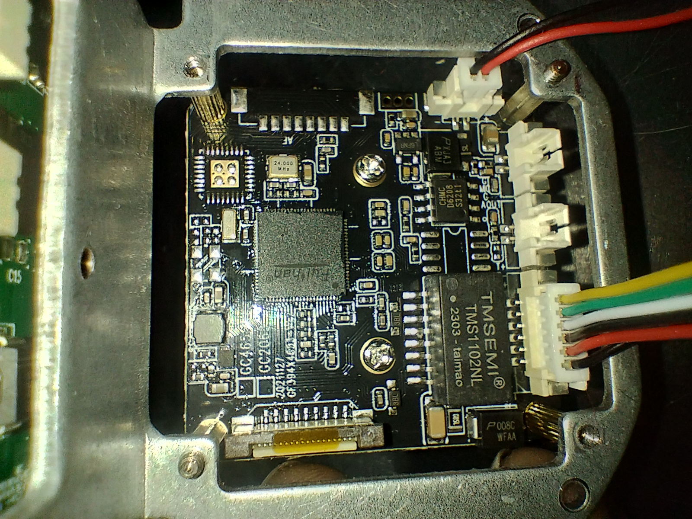
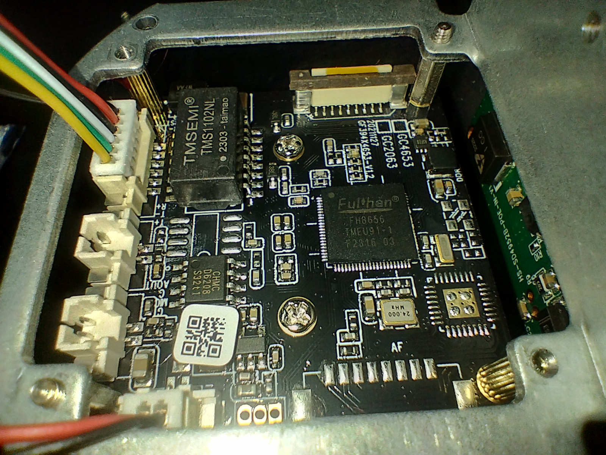
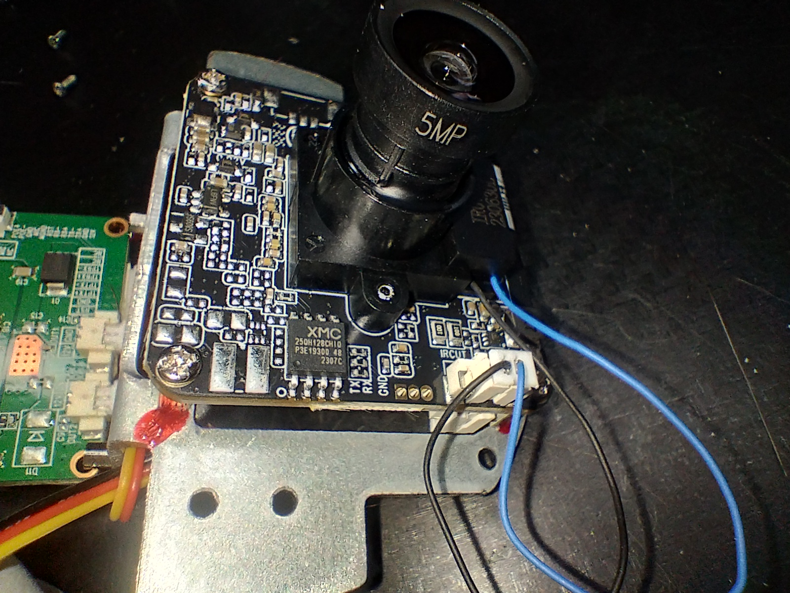
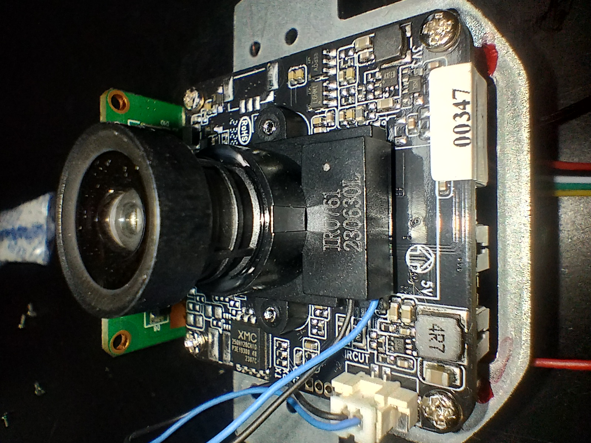
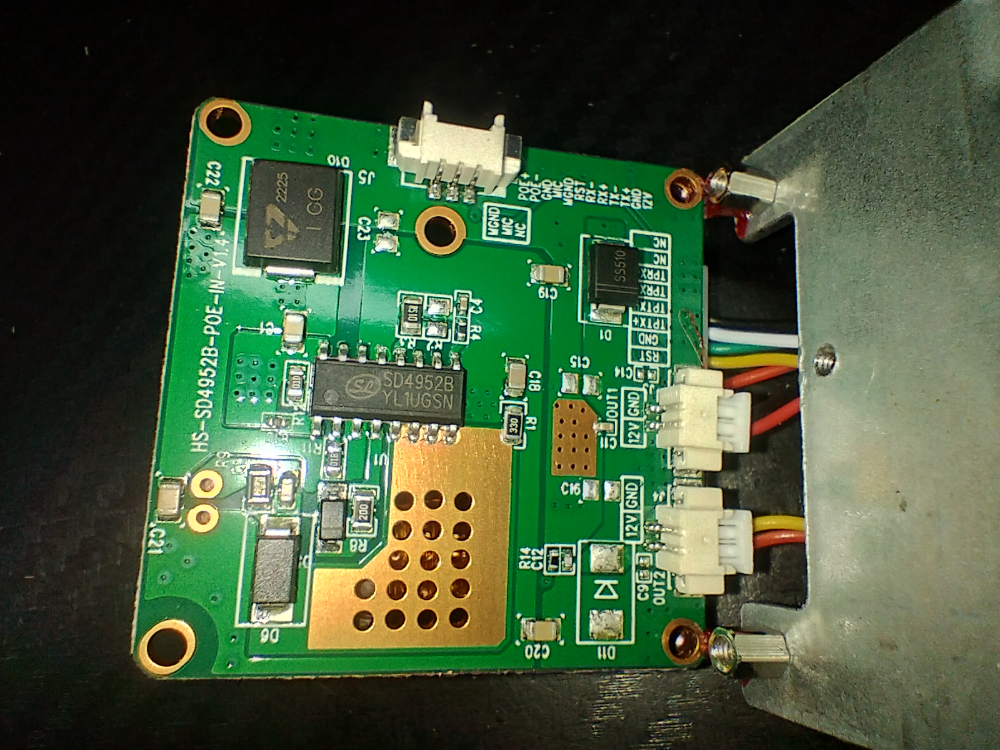
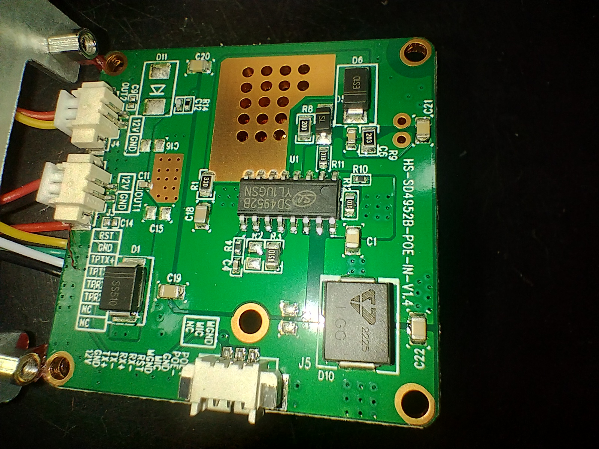

# FORCE IP-V-4025D

Teardown notes for a `FORCE`-branded PoE dome IP camera sold locally as `IP-V-4025D` (`4MP IR25` in inventory notes).

This writeup stays strict about what is actually visible in the available photos. Chip functions and platform family are marked as inferred unless the package or silkscreen is readable.

## Device Overview

The camera is a compact turret / dome-style network camera with:

- `RJ45` Ethernet on a pigtail
- barrel `DC` power input on the same pigtail
- separate internal PoE input stage
- black front window with camera module and dual-light window
- `FORCE` branding on the outer shell

| External view | Housing disassembled |
| :---: | :---: |
|  |  |

## Board Set

The teardown shows three main assemblies:

1. Main camera board with the SoC and support logic
2. Sensor / lens board with local flash and test pads
3. PoE input daughterboard

### Main Camera Board

| Main board overview | SoC area |
| :---: | :---: |
|  |  |

Visible markings on the main board:

- `GC4653_CY-09X6-2`
- `20211117`
- silkscreen `AF` near the lower edge

The most important readable IC markings are:

- `Fullhan FH8656`
- `TMSEMI TMS1102NL`

### Sensor / Lens Board

| Sensor board and flash | Lens module |
| :---: | :---: |
|  |  |

Visible markings:

- lens barrel marked `5MP`
- SPI flash marked `XMC 25QH128C...`
- test pads labeled `TX`, `RX`, and `GND`

The board clearly exposes a small serial/debug area directly next to the flash package.

### PoE Board

| PoE board front | PoE board back |
| :---: | :---: |
|  |  |

Visible markings:

- board family `HS-SD4952B-POE-IN-V1.x`
- controller `SD4952B`
- Schottky diode marked `SS510`
- large inductor marked `GC 2225`

One side of the photographed board reads `V1.4`; the opposite-side photo appears to show a different trailing revision digit and should be rechecked with a sharper macro before claiming the exact suffix.

## Identified Components

| Component | Role | Confidence | Evidence |
| --- | --- | --- | --- |
| Fullhan `FH8656` | Main camera SoC / ISP / encode pipeline | Confirmed | Package marking readable in `main_board_soc.jpg` |
| XMC `XM25QH128C` family | SPI NOR flash, `128 Mbit` / `16 MiB` | Confirmed | `XMC 25QH128C...` visible in `sensor_board_flash.jpg` |
| `SD4952B` | PoE input / power stage controller | Confirmed | Package marking readable on both PoE board photos |
| `TMSEMI TMS1102NL` | Support logic on the main board, exact function still unclear | Confirmed marking, inferred function | Readable package in `main_board_overview.jpg` / `main_board_soc.jpg` |
| GalaxyCore `GC4653` family image sensor | CMOS image sensor | Inferred, high | Main board silkscreen `GC4653_CY-09X6-2`; matches the platform naming used on the board |
| Lens module marked `5MP` | Lens assembly | Confirmed | Barrel text visible in `sensor_lens_5mp.jpg` |
| UART-style test pads (`TX/RX/GND`) | Debug / serial access point | Confirmed | Silkscreen visible near the XMC flash |
| RJ45 pigtail | Ethernet network input | Confirmed | Visible in `main_hero.png` |
| Barrel jack pigtail | Local DC power input | Confirmed | Visible in `main_hero.png` |

## Functional Layout

### Main Processing Path

The likely image path is:

1. sensor / lens board
2. board-to-board interconnect into the main board
3. `FH8656` SoC for image processing and compression
4. network delivery over Ethernet

This is consistent with the SoC placement, the camera form factor, and the lack of local display outputs.

### Storage / Firmware

The visible `XMC 25QH128C` flash indicates a `16 MiB` SPI NOR device. For this device class, that is a typical size for:

- bootloader
- kernel
- application filesystem
- calibration / parameter partitions

### Power Architecture

The internal power path appears split between:

- an external PoE daughterboard based on `SD4952B`
- local regulation and support circuitry on the camera board
- optional barrel-jack DC feed on the cable harness

This matches the combination of `RJ45` and barrel power on the pigtail.

## Confirmed vs Inferred

### Confirmed

- Device branding: `FORCE`
- Model family from local inventory notes: `IP-V-4025D`
- Ethernet and barrel power pigtail
- Main SoC: `Fullhan FH8656`
- SPI flash: `XMC 25QH128C` family
- PoE controller: `SD4952B`
- Support IC marking: `TMSEMI TMS1102NL`
- Main board silkscreen `GC4653_CY-09X6-2`
- Main board date marking `20211117`
- Lens marking `5MP`
- Debug pads labeled `TX`, `RX`, `GND`

### Inferred

- The camera platform is a Fullhan-based network camera centered on `FH8656`
- The image sensor is very likely a `GC4653` family part
- The `TMS1102NL` device is support logic rather than the primary processor
- The PoE board revision suffix should be treated as tentative until a sharper macro confirms the exact `V1.x`

## Open Questions

- Read the exact package code on the image sensor itself
- Confirm the exact board revision suffix on the PoE daughterboard
- Identify the role of `TMSEMI TMS1102NL`
- Read the small 8-pin device markings around the main board power section
- Trace whether the visible `TX/RX/GND` pads expose the boot console directly

## Next Recon Steps

- take one tighter macro centered on the sensor package
- take a flatter macro of the PoE board silkscreen to settle the revision
- dump and archive the `XM25QH128C` flash contents
- map the `TX/RX/GND` pads against the cable ground and SoC pins
- probe the barrel input versus PoE input path for diode OR-ing or rail selection

## Photo Walkthrough

### Assembly Context

The stacked construction is visible here: the lens/sensor module sits above the main board, while the PoE board occupies a lower layer near the cable entry and power path.
