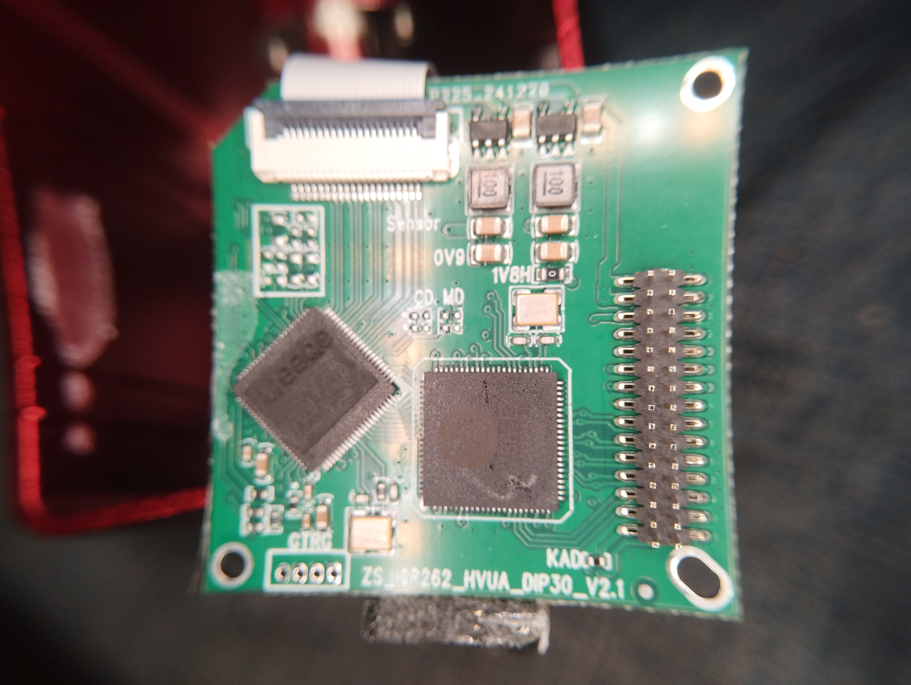
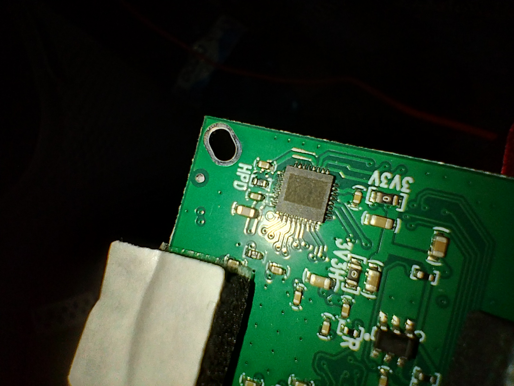

# 🛰️ YIZHAN XVH2003 HDMI/VGA Microscope Camera – Teardown & PCB Analysis

## 🔍 Overview
- **Model:** YIZHAN XVH2003
- **Sensor:** GC2053 (1/3")
- **Output:** HDMI / VGA (1080p)
- **Marketing:** "13MP" (interpolated)
- **Recording:** ❌ No SD slot / No USB storage

## 🛠️ Mainboard Identification
- **PCB marking:** ZS_ISP262_HVUA_DP30_V2.1 / KADC-J
- **Front I/O board:** ZS_6kay_HV_DIP30_V2.1
- **Sensor board:** ZS_sensor269_FPC20_V1.0

## 🧠 Main SoC (ISP)
- **Marking:** 8788-EX / HW5342
- **Manufacturer:** Likely Fullhan (FH)
- **Architecture:** Not Linux (Bare-metal or RTOS)
- **Function:** ISP, Scaling, Parallel Interface, RGB Output.

## 📡 Interfaces & Debug
- **Sensor:** Parallel CMOS interface (confirmed by PCLK, 2V8, 1V2 signals).
- **UART:** 4-pin cluster near RTCK pads. 
- **Settings:** Likely 115200 8N1 @ 3.3V TTL.

## 🔬 Microscope Inspection (DRO)

## 🏁 Conclusion
The YIZHAN XVH2003 is a dedicated video processing pipeline without local storage or Linux OS. High value for industrial applications but requires external capture for recording.

---
*Part of the PCB-Reconnaissance project.*
