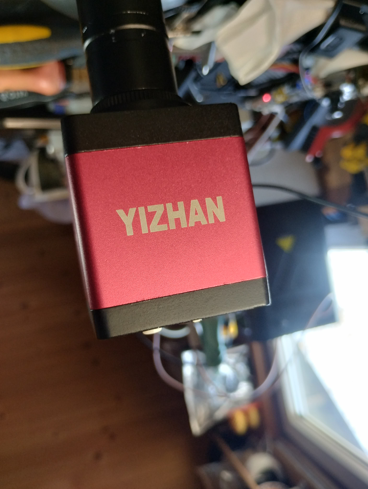
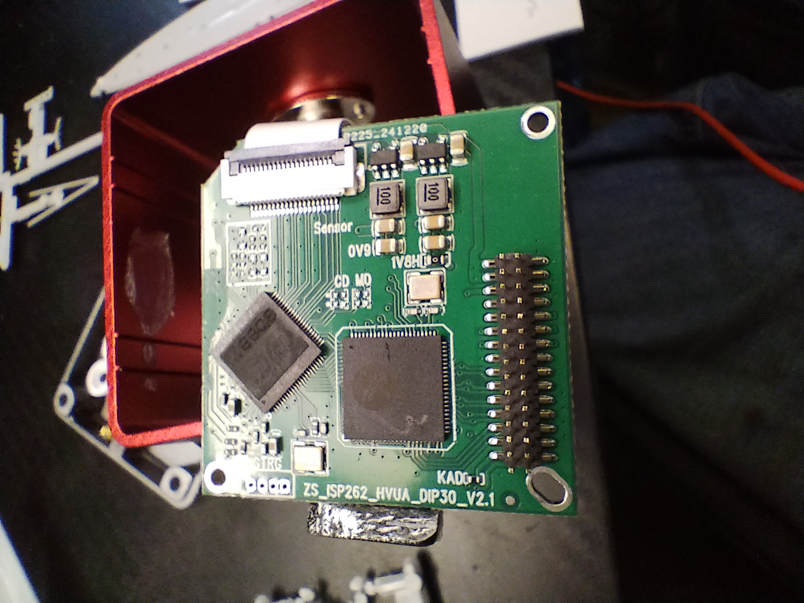
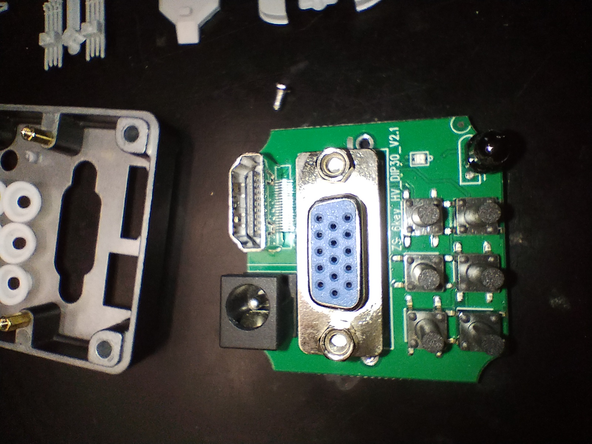
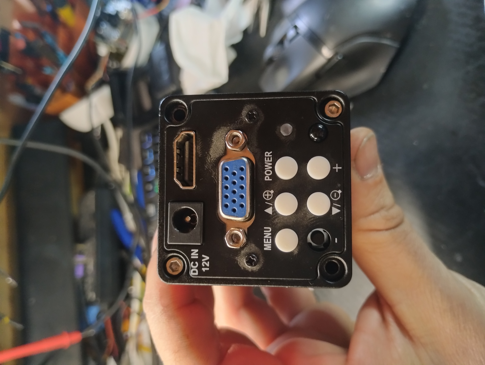
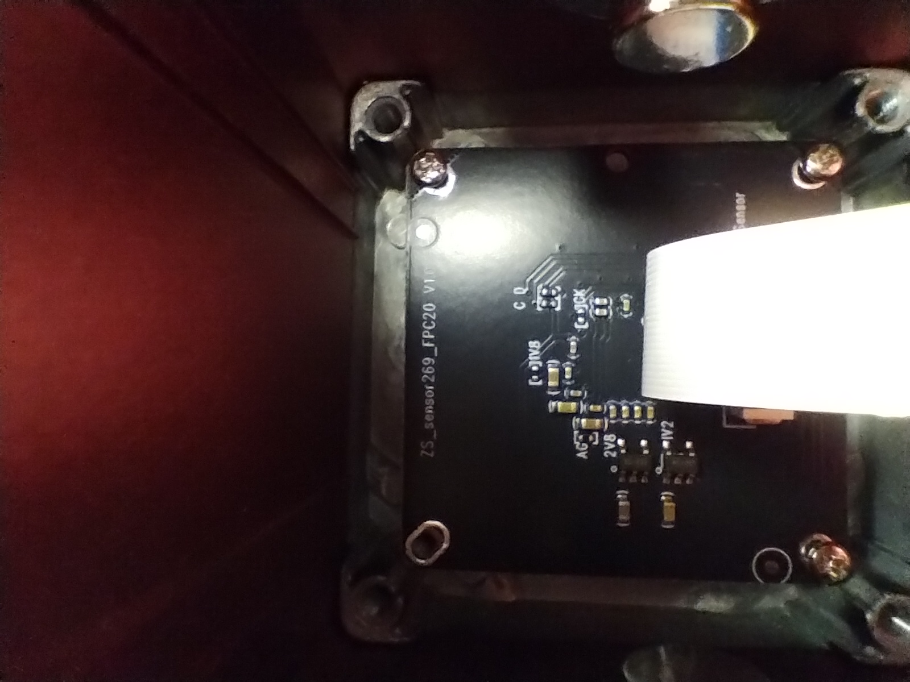

# 🛰️ PCB-Reconnaissance: YIZHAN XVH2003 Teardown

## 🔍 The Main Hero (Full Internal View)
Detailed hardware analysis of the YIZHAN XVH2003 HDMI/VGA Industrial Camera.

---

## 🛠️ Mainboard Architecture
### Top View & SoC
The heart of the device is the Fullhan Image Signal Processor. Signal routing is dense, optimized for real-time 1080p scaling.

| Main Board (Top) | SoC Macro (Fullhan) |
| :---: | :---: |
|  |  |

### Bottom Board & Power
The secondary layer handles power regulation and sensor interfacing.

---

## 🔌 Interfaces & Enclosure
### I/O Panel & Controls
Integrated buttons for OSD menu management and physical output ports (VGA/HDMI).

| I/O Board & Buttons | Enclosure Port Cover |
| :---: | :---: |
|  |  |

### The "Eye" (Sensor)
Featuring the GalaxyCore GC2053 sensor, providing the high-definition feed for the entire pipeline.

---

## 🔬 Microscope Recon (DRO)
Digital microscopic analysis of critical signal points.

| Sensor Pads | ISP Traces | PCB Labels |
| :---: | :---: | :---: |
|  |  |  |

---

## ⚖️ Safe Harbor
Educational hardware reconnaissance by **Lab t4rg3d**. 
Crack the Planet. If you can't open it, you don't own it.

