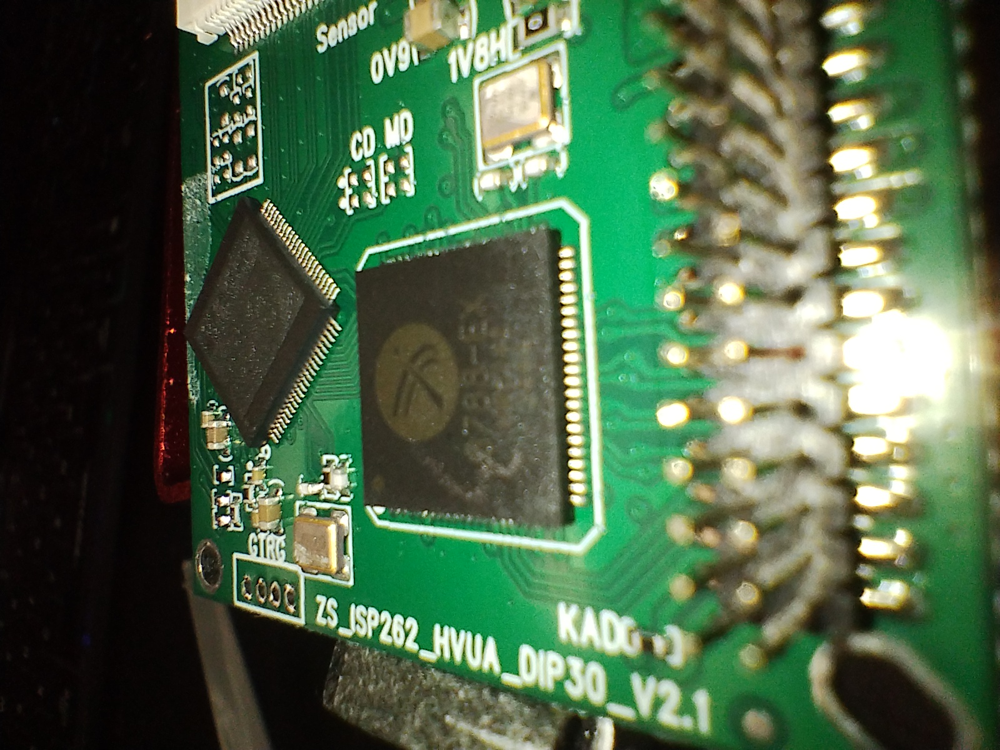
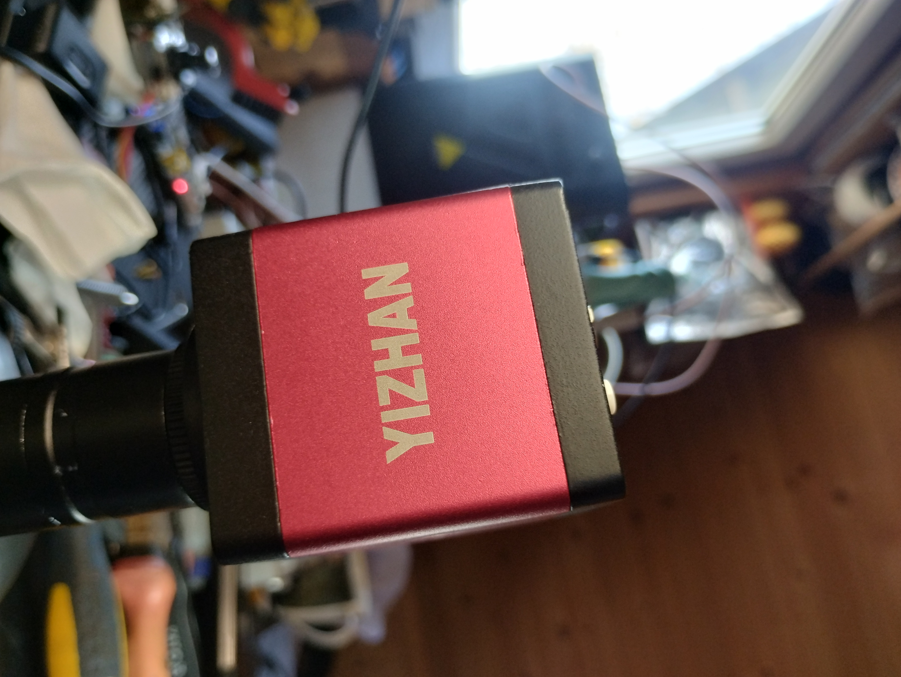

# 🛰️ YIZHAN XVH2003 HDMI/VGA Microscope Camera – Teardown & PCB Analysis

## 🔍 Overview
- **Model:** YIZHAN XVH2003
- **Sensor:** GC2053 (1/3")
- **Output:** HDMI / VGA (1080p)
- **Marketing:** "13MP" (interpolated)

## 🛠️ Mainboard Identification
- **Main PCB:** ZS_ISP262_HVUA_DIP30_V2.1
- **I/O Board:** ZS_6kay_HV_DIP30_V2.1

## 🧠 SoC and Signals
The core logic is handled by a Fullhan 8788-EX ISP. 
Detailed inspection of the HDMI section reveals HPD (Hot Plug Detect) signals and dedicated 3.3V rails.

## 📡 Sensor Interface
The sensor connects via a 30-pin FPC/DIP interface. Parallel CMOS signals (PCLK, DATA) are routed directly to the ISP.

---
*Part of the PCB-Reconnaissance project by c3l3r1on.*
