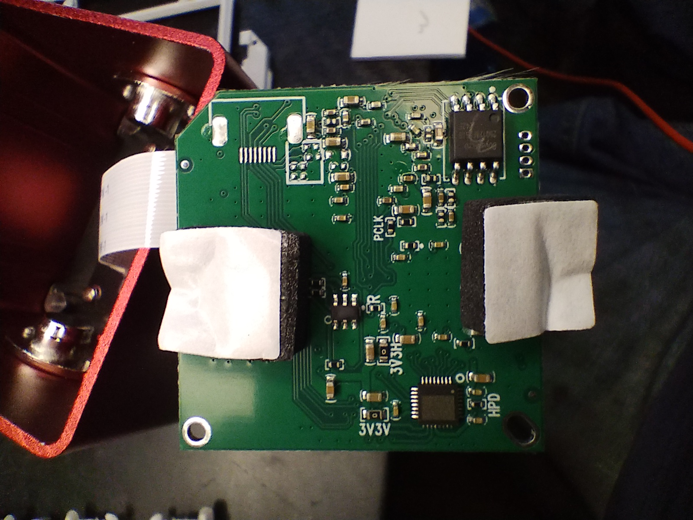

# 🛰️ YIZHAN XVH2003 HDMI/VGA Microscope Camera – Teardown & PCB Analysis

## 🔍 Overview
- **Model:** YIZHAN XVH2003
- **Sensor:** GC2053 (1/3")
- **Output:** HDMI / VGA (1080p)
- **Marketing:** "13MP" (interpolated)

## 🛠️ Mainboard Identification (ZS_ISP262_HVUA_DIP30_V2.1)
The primary board houses the main Image Signal Processor (ISP). It is a highly integrated, fixed-function board with no local storage capabilities (no eMMC/NAND/SD).

## 🧠 Main SoC
- **Marking:** 8788-EX / HW5342
- **Manufacturer:** Likely Fullhan (FH)
- **Architecture:** Bare-metal or RTOS (Not Linux)

## 🔌 I/O Board (ZS_6key_HV_DIP30_V2.1)
The secondary board manages physical interfaces and user input via 6 tact-switches.

## 📡 Signal Routing & Power
The back of the mainboard reveals test pads and signal routing, including dedicated rails for the HDMI section (3V3V, 3V3H) and Hot Plug Detect (HPD). The sensor connects via parallel CMOS interface (PCLK visible).

---
*Documented by Lab t4rg3d / PCB-Reconnaissance.*
